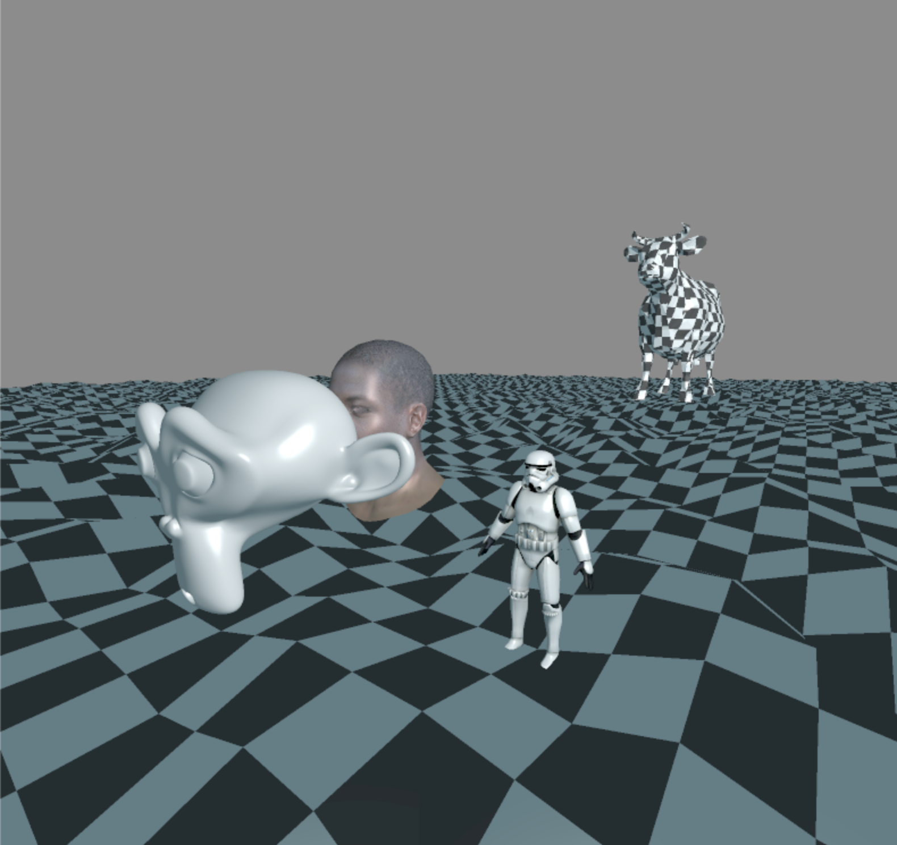

## 3D Software Renderer

- requires SDL2 and AVX2

## current progress:

## Sources: 
- [ScratchPixel](https://www.scratchapixel.com/lessons/3d-basic-rendering/rasterization-practical-implementation/overview-rasterization-algorithm.html)
- [HandmadeHero SIMD](https://www.youtube.com/watch?v=YnnTb0AQgYM&t=340s&ab_channel=MollyRocket)
- [Intel intrinsics guide](https://www.intel.com/content/www/us/en/docs/intrinsics-guide/index.html)
